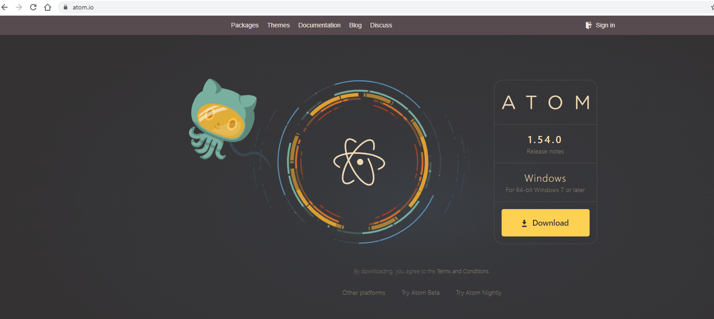
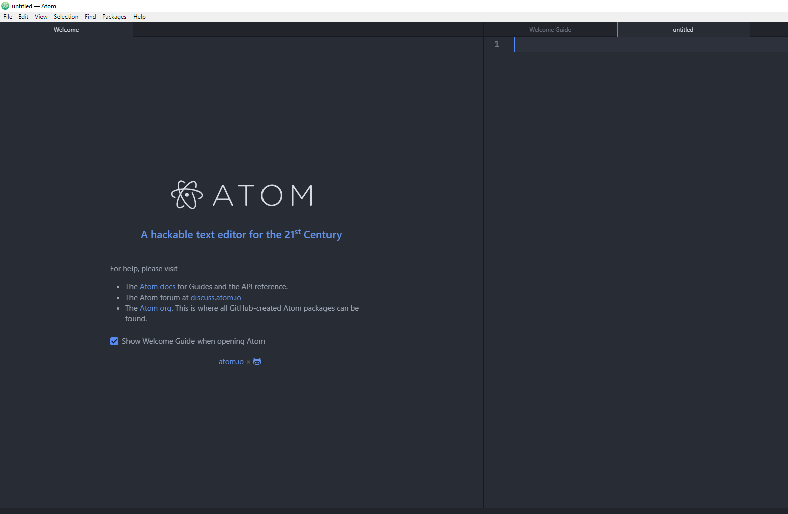
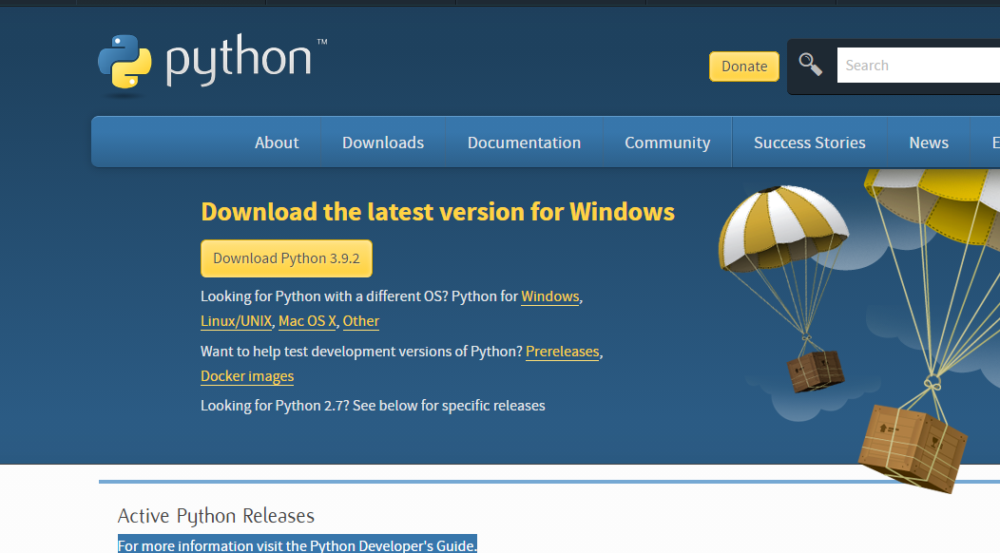
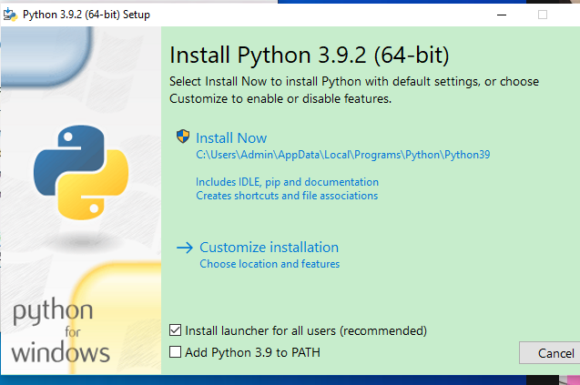
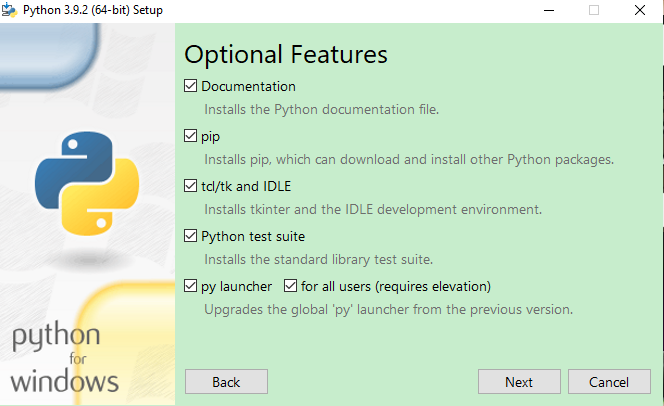
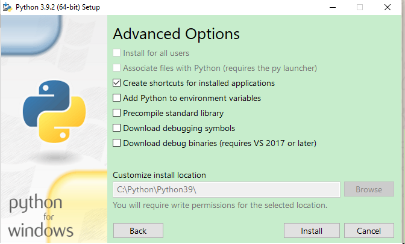
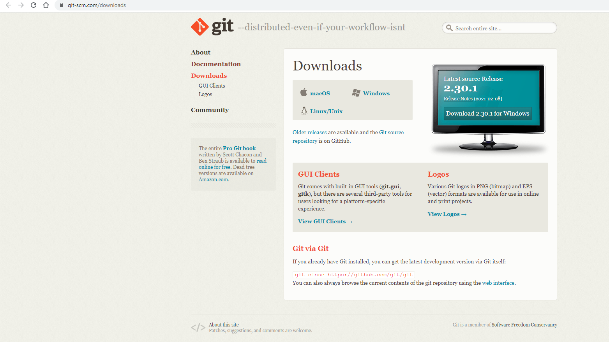

# Installation

## Day 1

### Atom IDE

- Visit https://atom.io/ and click download

- It will show a dialog box stating download in progress

- Done

### Python

- Visit https://www.python.org/downloads/ and click download for 3.9.2

- Click custom installation and check adding python to path.

- Check all the optional features here.

- Change the directory to C:\Python\Python39, my screenshot will look a little bit different to yours as I have installed earlier.

- Click Disable path length limit and click yes in the next dialog box.

- You can see python installed when you search python in start menu.

### Git

- To download the Git installer, visit the Git's official site and go to download page. The link for the download page is https://git-scm.com/downloads. The page looks like as

- Click on the package given on the page as download 2.30.1 for windows. The download will start after selecting the package, I have version 2.23.0 thus some pages maybe a bit different , if a new page occurs choose the default option.

- Click on the downloaded installer file and select yes to continue. After the selecting yes the installation begins

- Default components are automatically selected in this step. You can also choose your required part, for now default components are enough

- The default Git command-line options are selected automatically. You can choose your preferred choice. Click next to continue.

- The default transport backend options are selected in this step. Click next to continue.

- Select your required line ending option and click next to continue.

- Select preferred terminal emulator clicks on the next to continue with the default checked one.

- This is the last step that provides some extra features like system caching, credential management and symbolic link. Select the required features and click on the next option.

- The Git installation is completed
